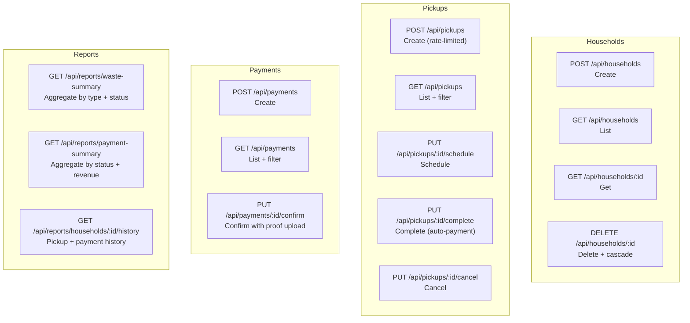

# API Reference

All 15 product endpoints, the response envelope contract, and links to
the machine-readable API artefacts.

---

## Endpoint Map



Extra (not in the 15): `GET /health` (liveness), `GET /readyz` (readiness
with DB ping).

---

## Response Envelope

Every response uses the same JSON envelope. The handler helpers
`respond`, `respondError`, and `respondList` in
`internal/handler/handler.go` enforce this contract.

### Success — single object

```json
{
  "success": true,
  "data": { ... }
}
```

### Success — collection

```json
{
  "success": true,
  "data": [ ... ],
  "meta": {
    "total": 42,
    "page": 1,
    "per_page": 20
  }
}
```

### Error

```json
{
  "success": false,
  "code": "VALIDATION_ERROR",
  "message": "owner_name is required"
}
```

| HTTP status | `code` value | Trigger |
|---|---|---|
| 400 | `VALIDATION_ERROR` | Input fails validator.v10 or body-limit exceeded |
| 404 | `NOT_FOUND` | Resource does not exist |
| 409 | `CONFLICT` | BR-01 pending payment, BR-02 wrong status |
| 413 | `FILE_TOO_LARGE` | File exceeds `MAX_UPLOAD_SIZE_MB` |
| 422 | `BUSINESS_RULE_VIOLATION` | BR-03 electronic safety check |
| 429 | `RATE_LIMITED` | Pickup creation rate limit hit |
| 500 | `INTERNAL_ERROR` | Unexpected server error |

---

## Rate Limiting

`POST /api/pickups` is the only rate-limited endpoint. The limit is
per-IP, enforced by a token-bucket rate limiter in
`internal/middleware/ratelimit.go`.

Environment variables: `RATE_LIMIT_RPS` (tokens per second),
`RATE_LIMIT_BURST` (maximum burst).

---

## API Artefacts

| Artefact | Path | Used by |
|---|---|---|
| OpenAPI 3.0 spec | `api/openapi.yaml` | Redocly lint in `contract` CI job; client generation |
| Postman collection | `api/community-waste.postman_collection.json` | Newman smoke test in `e2e` CI job; manual testing |
| Insomnia collection | `api/community-waste.insomnia_collection.json` | Manual testing |

Both Postman and Insomnia collections have 27 requests each. The `contract`
CI job (`ci.yml`) verifies they stay in sync via a Python count check.
