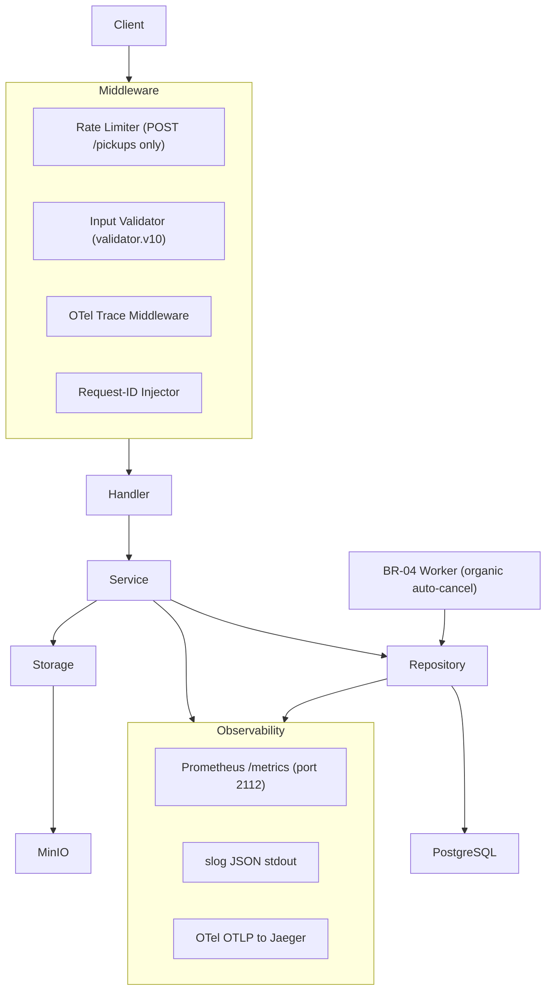
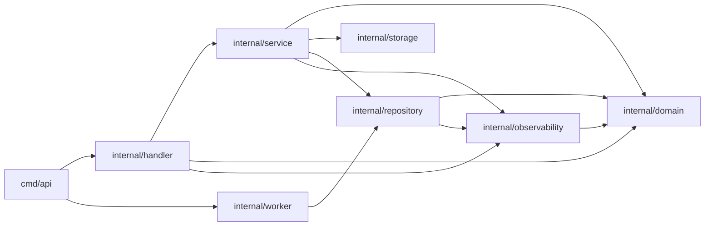

# Architecture

## Layer responsibilities

```
cmd/api/main.go         DI wiring, graceful shutdown, signal handling
internal/config/        Env-var configuration (validated on startup)
internal/domain/        Entities, service/repository interfaces, sentinel errors
internal/handler/       Echo HTTP handlers, request parsing, response envelope
internal/middleware/    Rate limiter, request ID injection, OTel trace, logger
internal/service/       All business logic — BR-01..BR-06 enforcement
internal/repository/    sqlx SQL implementations — no business logic
internal/storage/       S3/MinIO upload client
internal/observability/ slog logger, OTel tracer, Prometheus metrics registration
internal/worker/        Background organic-pickup auto-canceler (BR-04)
internal/mocks/         Testify/mockery generated mocks for domain interfaces
migrations/             golang-migrate SQL files (numbered up + down pairs)
test/e2e/               End-to-end tests (build tag: e2e)
test/perf/              HTTP performance benchmarks (build tag: perf)
test/load/              k6 load-test scenarios
test/dashboards/        Grafana dashboard correctness suite (lint, metrics, E2E, Playwright)
deployments/            Docker Compose, Prometheus config, Grafana provisioning
```

Dependencies only flow inward. Domain interfaces decouple layers so each
can be unit-tested in isolation using the generated mocks.

## Business rules

| # | Rule | Enforcement location |
|---|------|----------------------|
| BR-01 | Household with a pending payment cannot create a new pickup | `service/pickup.go` Create — `EXISTS` check via `HasPendingPaymentForHousehold` + partial UNIQUE index `uq_payments_one_pending_per_household` as DB-level guard |
| BR-02 | Only pending pickups can be scheduled; only scheduled can be completed or cancelled | Conditional `UPDATE … WHERE status=?` → `ErrConflict` on wrong status |
| BR-03 | Electronic pickup requires `safety_check: true` before scheduling | Service validation → `ErrBusinessRule` → 422 |
| BR-04 | Organic pickups not scheduled within 3 days are auto-cancelled | `worker/organic_canceler.go` — ticks on `WORKER_CANCEL_INTERVAL`, exits cleanly on context cancel |
| BR-05 | Completing a pickup atomically auto-creates a payment record | `BEGIN/COMMIT` transaction in `service/pickup.go` Complete — conditional `UPDATE WHERE status='scheduled'` + `INSERT payment` in one transaction |
| BR-06 | Payment confirmation requires a multipart proof-of-payment file upload | MIME allowlist + magic-byte sniff + MinIO upload in `service/payment.go` Confirm |

## Request flow

```
Client → Echo middleware stack
       → handler (parse + validate input)
       → service (enforce BRs, compose transactions)
       → repository (execute SQL via sqlx)
       → PostgreSQL
       ↳ S3/MinIO (payment proof upload only)
```

## Observability

Three signal types, all correlated via `trace_id`:

- **Metrics** — 21 Prometheus instruments registered at package init in
  `internal/observability/metrics.go`. Scraped at `:2112/metrics`. Three
  Grafana dashboards auto-provisioned under `deployments/grafana/`.
- **Logs** — `log/slog` JSON to stdout. Every line carries `trace_id`,
  `span_id`, `request_id`, `op`. Promtail tails container stdout → Loki.
- **Traces** — OTel Go SDK, OTLP/HTTP export to Jaeger's native receiver
  (`jaeger:4318`). No intermediary collector. All handler, service,
  repository, worker, and storage functions create named child spans.

## Database

PostgreSQL 17 with five migrations:

| # | Migration | Purpose |
|---|-----------|---------|
| 000001 | Create tables | Baseline schema — households, waste_pickups, payments |
| 000002 | Add indexes | Lookup indexes on foreign keys |
| 000003 | Enum changes | Waste type enum updates |
| 000004 | Unique pending payment | Partial UNIQUE index `uq_payments_one_pending_per_household` (BR-01 DB-level guard) |
| 000005 | Performance indexes | Composite indexes for list + filter queries |

## Configuration

All configuration via environment variables. See `internal/config/config.go`
for defaults and validation. Key tunables:

- `RATE_LIMIT_RPS` / `RATE_LIMIT_BURST` — pickup creation rate limit
- `WORKER_CANCEL_INTERVAL` / `WORKER_ORGANIC_CUTOFF_DAYS` — BR-04 timing
- `MAX_UPLOAD_SIZE_MB` — proof file cap
- `OTEL_EXPORTER_OTLP_ENDPOINT` — Jaeger OTLP address

## Graceful shutdown

`cmd/api/main.go` catches SIGINT/SIGTERM, cancels the root context
(worker drain), then calls `e.Shutdown(ctx)` (HTTP drain within
`HTTPShutdownTimeout`). Both the HTTP server and the background worker
participate in a `sync.WaitGroup` so the process does not exit until
in-flight work is complete.

## Wire surface

One row per product endpoint — handler, service, repository, and primary test coverage.

| Endpoint | Handler | Service | Repository | Coverage |
|----------|---------|---------|------------|---------|
| `POST /api/households` | `handler/household.go:CreateHousehold` | `service/household.go:Create` | `repository/household.go:Insert` | `handler/household_test.go`, `e2e/household_test.go` |
| `GET /api/households` | `handler/household.go:ListHouseholds` | `service/household.go:List` | `repository/household.go:List` | `handler/household_test.go` |
| `GET /api/households/:id` | `handler/household.go:GetHousehold` | `service/household.go:GetByID` | `repository/household.go:FindByID` | `handler/household_test.go` |
| `DELETE /api/households/:id` | `handler/household.go:DeleteHousehold` | `service/household.go:Delete` | `repository/household.go:Delete` | `handler/household_test.go` |
| `POST /api/pickups` | `handler/pickup.go:CreatePickup` | `service/pickup.go:Create` | `repository/pickup.go:Create` | `handler/pickup_test.go`, `e2e/concurrency_test.go` |
| `GET /api/pickups` | `handler/pickup.go:ListPickups` | `service/pickup.go:List` | `repository/pickup.go:List` | `handler/pickup_test.go` |
| `PUT /api/pickups/:id/schedule` | `handler/pickup.go:SchedulePickup` | `service/pickup.go:Schedule` | `repository/pickup.go:Schedule` | `handler/pickup_test.go`, `e2e/pickup_test.go` |
| `PUT /api/pickups/:id/complete` | `handler/pickup.go:CompletePickup` | `service/pickup.go:Complete` | `repository/pickup.go:UpdateStatus`, `repository/payment.go:CreateWithTx` | `handler/pickup_test.go`, `e2e/concurrency_test.go` |
| `PUT /api/pickups/:id/cancel` | `handler/pickup.go:CancelPickup` | `service/pickup.go:Cancel` | `repository/pickup.go:Cancel` | `handler/pickup_test.go` |
| `POST /api/payments` | `handler/payment.go:CreatePayment` | `service/payment.go:Create` | `repository/payment.go:Create` | `handler/payment_test.go`, `e2e/payment_test.go` |
| `GET /api/payments` | `handler/payment.go:ListPayments` | `service/payment.go:List` | `repository/payment.go:List` | `handler/payment_test.go` |
| `PUT /api/payments/:id/confirm` | `handler/payment.go:ConfirmPayment` | `service/payment.go:Confirm` | `repository/payment.go:Confirm` | `handler/payment_test.go`, `e2e/payment_test.go` |
| `GET /api/reports/waste-summary` | `handler/report.go:WasteSummary` | `service/report.go:WasteSummary` | `repository/pickup.go` | `handler/report_test.go` |
| `GET /api/reports/payment-summary` | `handler/report.go:PaymentSummary` | `service/report.go:PaymentSummary` | `repository/payment.go` | `handler/report_test.go` |
| `GET /api/reports/households/:id/history` | `handler/report.go:HouseholdHistory` | `service/report.go:HouseholdHistory` | `repository/pickup.go`, `repository/payment.go` | `handler/report_test.go`, `e2e/report_test.go` |

## Domain invariants

| Invariant | Enforcement | Test | HTTP on violation |
|-----------|-------------|------|-------------------|
| Single open billing cycle per household (BR-01) | `service/pickup.go:Create` EXISTS check + partial UNIQUE index `uq_payments_one_pending_per_household` | `service/pickup_test.go`, `e2e/concurrency_test.go` | 409 |
| Pickup status state machine (BR-02) | Conditional `UPDATE WHERE status=<expected>` in repository; `ErrConflict` on wrong status | `service/pickup_test.go`, `e2e/pickup_test.go` | 409 |
| Electronic safety check required (BR-03) | `service/pickup.go:Schedule` validates `safety_check` flag | `service/pickup_test.go` | 422 |
| Organic auto-cancellation after 3 days (BR-04) | `worker/organic_canceler.go` ticks on `WORKER_CANCEL_INTERVAL` | `e2e/pickup_test.go` | — (background) |
| Atomic pickup completion + payment creation (BR-05) | `service/pickup.go:Complete` DB transaction: UPDATE + INSERT | `service/pickup_test.go`, `e2e/concurrency_test.go` | 409 |
| Proof-file required for payment confirmation (BR-06) | `handler/payment.go` MIME allowlist + magic-byte sniff; `service/payment.go:Confirm` nil-reader guard | `handler/payment_test.go`, `e2e/payment_test.go` | 400 |

## Visual Reference

### Layered Architecture

Dependencies flow strictly inward. Each layer is testable in isolation
via the generated mocks in `internal/mocks/`.



### Module Dependency Graph

`internal/domain` defines interfaces and entities. All other packages
depend on it — nothing depends on them back.



### Dependency-Injection Wiring

Constructor injection wires real implementations at startup. Tests swap
in the mocks from `internal/mocks/` at the same seams.

```mermaid
graph TD
    main["cmd/api/main.go"] -->|NewPickupRepository| PR["PickupRepository (sqlx)"]
    main -->|NewPaymentRepository| PAR["PaymentRepository (sqlx)"]
    main -->|NewHouseholdRepository| HR["HouseholdRepository (sqlx)"]
    main -->|NewStorageClient| SC["StorageClient (MinIO)"]
    main -->|"NewPickupService(PR + PAR + db)"| PS["PickupService"]
    main -->|"NewPaymentService(PAR + SC)"| PAS["PaymentService"]
    main -->|"NewHouseholdService(HR)"| HS["HouseholdService"]
    main -->|"NewHandler(PS + PAS + HS)"| H["Echo Handler"]

    TestPickupService["test: pickup_test.go"] -->|mocks.NewPickupRepository| MockPR["mock PickupRepository"]
    TestPickupService -->|mocks.NewPaymentRepository| MockPAR["mock PaymentRepository"]
    TestPickupService -->|sqlmock DB| MockDB["mock sqlx.DB"]
    TestPickupService -->|"NewPickupService(MockPR + MockPAR + MockDB)"| PS
```


