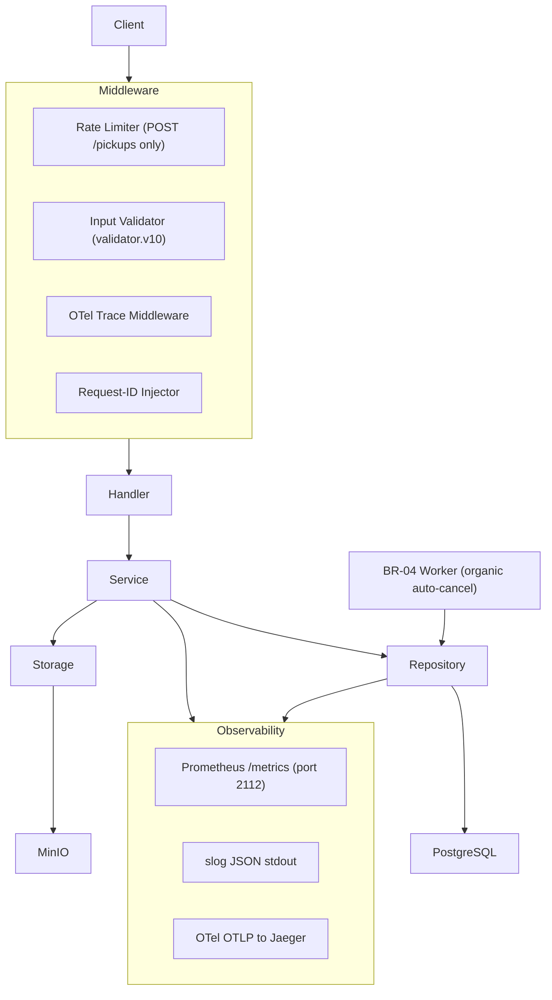
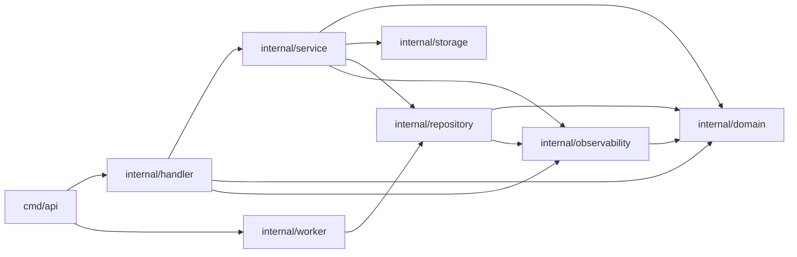
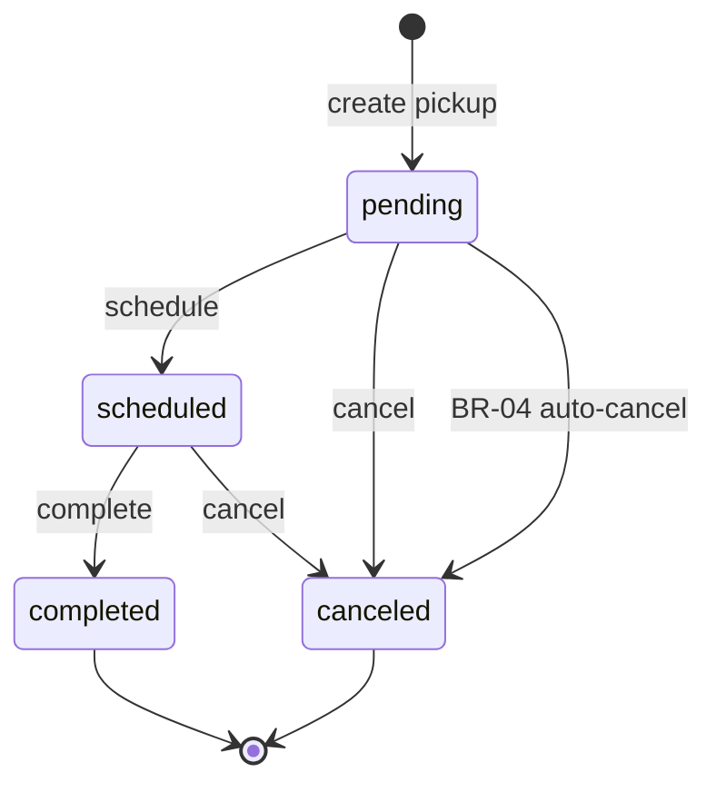
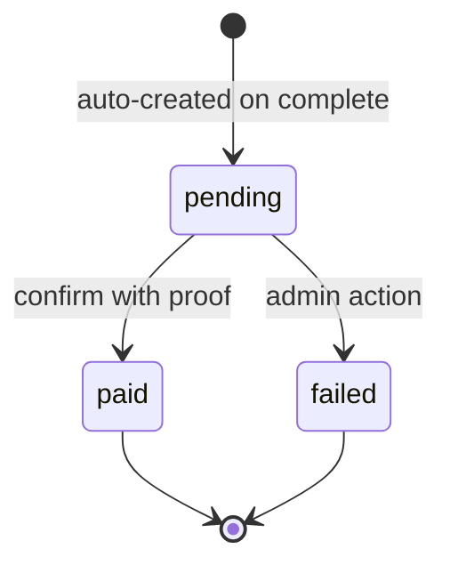
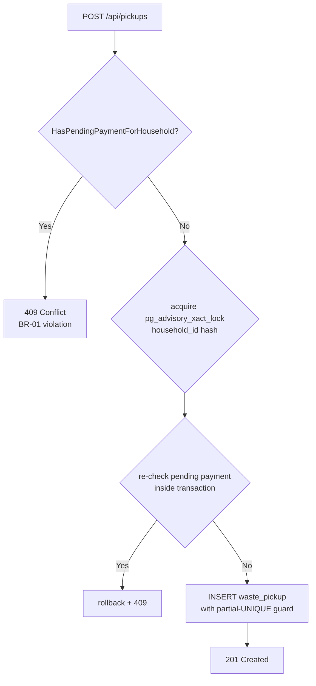
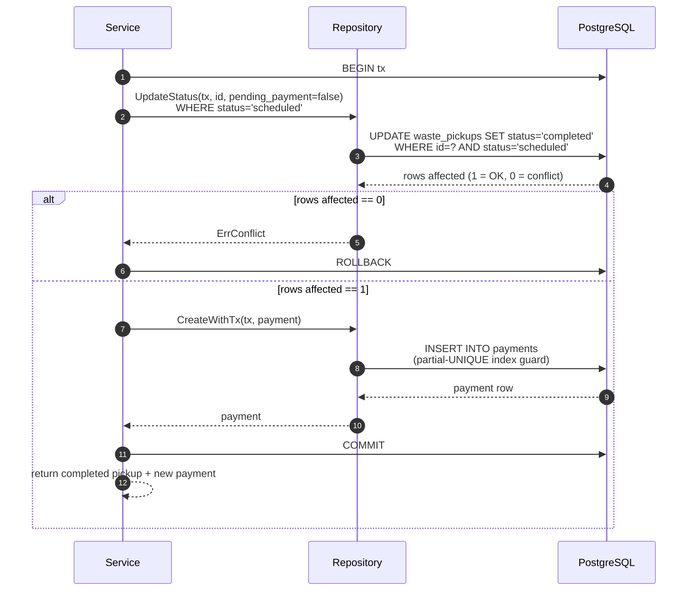
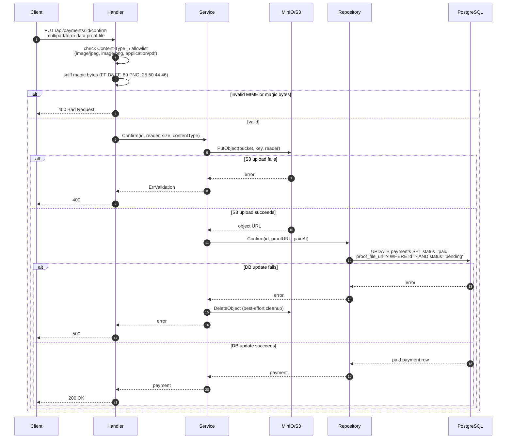
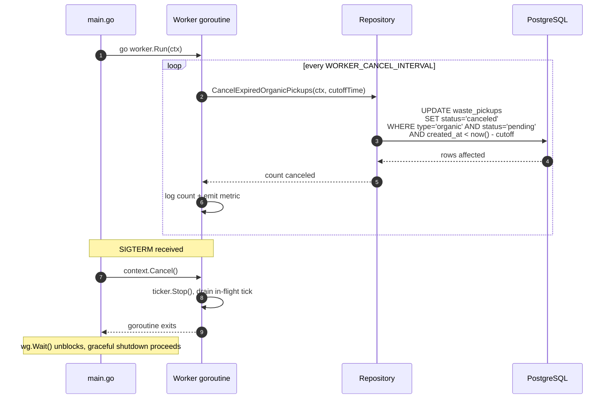
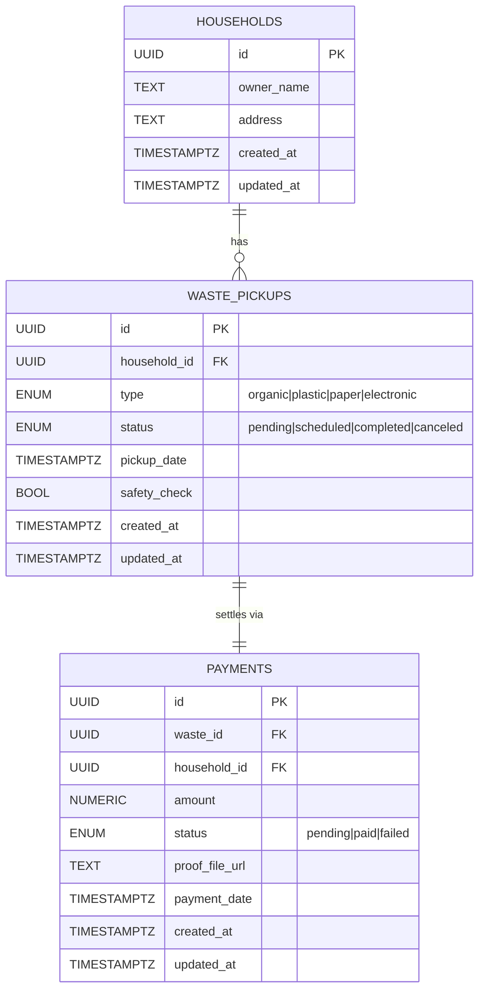
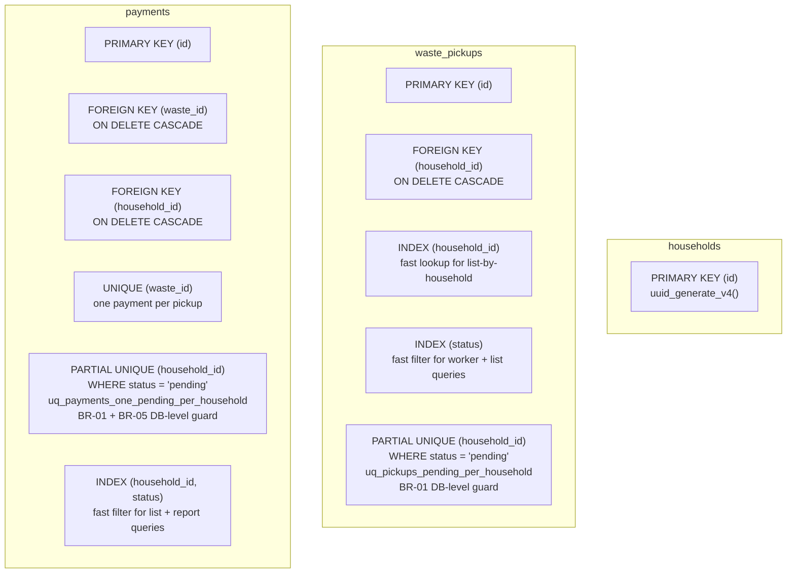

# Architecture

## Layer responsibilities

```
cmd/api/main.go         DI wiring, graceful shutdown, signal handling
internal/config/        Env-var configuration (validated on startup)
internal/domain/        Entities, service/repository interfaces, sentinel errors
internal/handler/       Echo HTTP handlers, request parsing, response envelope
internal/middleware/    Rate limiter, request ID injection, OTel trace, logger
internal/service/       All business logic — BR-01..BR-06 enforcement
internal/repository/    sqlx SQL implementations — no business logic
internal/storage/       S3/MinIO upload client
internal/observability/ slog logger, OTel tracer, Prometheus metrics registration
internal/worker/        Background organic-pickup auto-canceler (BR-04)
internal/mocks/         Testify/mockery generated mocks for domain interfaces
migrations/             golang-migrate SQL files (numbered up + down pairs)
test/e2e/               End-to-end tests (build tag: e2e)
test/perf/              HTTP performance benchmarks (build tag: perf)
test/load/              k6 load-test scenarios
test/dashboards/        Grafana dashboard correctness suite (lint, metrics, E2E, Playwright)
deployments/            Docker Compose, Prometheus config, Grafana provisioning
```

Dependencies only flow inward. Domain interfaces decouple layers so each
can be unit-tested in isolation using the generated mocks.

## Business rules

| # | Rule | Enforcement location |
|---|------|----------------------|
| BR-01 | Household with a pending payment cannot create a new pickup | `service/pickup.go` Create — `EXISTS` check via `HasPendingPaymentForHousehold` + partial UNIQUE index `uq_payments_one_pending_per_household` as DB-level guard |
| BR-02 | Only pending pickups can be scheduled; only scheduled can be completed or cancelled | Conditional `UPDATE … WHERE status=?` → `ErrConflict` on wrong status |
| BR-03 | Electronic pickup requires `safety_check: true` before scheduling | Service validation → `ErrBusinessRule` → 422 |
| BR-04 | Organic pickups not scheduled within 3 days are auto-cancelled | `worker/organic_canceler.go` — ticks on `WORKER_CANCEL_INTERVAL`, exits cleanly on context cancel |
| BR-05 | Completing a pickup atomically auto-creates a payment record | `BEGIN/COMMIT` transaction in `service/pickup.go` Complete — conditional `UPDATE WHERE status='scheduled'` + `INSERT payment` in one transaction |
| BR-06 | Payment confirmation requires a multipart proof-of-payment file upload | MIME allowlist + magic-byte sniff + MinIO upload in `service/payment.go` Confirm |

## Request flow

```
Client → Echo middleware stack
       → handler (parse + validate input)
       → service (enforce BRs, compose transactions)
       → repository (execute SQL via sqlx)
       → PostgreSQL
       ↳ S3/MinIO (payment proof upload only)
```

## Observability

Three signal types, all correlated via `trace_id`:

- **Metrics** — 21 Prometheus instruments registered at package init in
  `internal/observability/metrics.go`. Scraped at `:2112/metrics`. Three
  Grafana dashboards auto-provisioned under `deployments/grafana/`.
- **Logs** — `log/slog` JSON to stdout. Every line carries `trace_id`,
  `span_id`, `request_id`, `op`. Promtail tails container stdout → Loki.
- **Traces** — OTel Go SDK, OTLP/HTTP export to Jaeger's native receiver
  (`jaeger:4318`). No intermediary collector. All handler, service,
  repository, worker, and storage functions create named child spans.

## Database

PostgreSQL 17. Schema, indexes and migrations: [Data model](#data-model).

## Configuration

All configuration via environment variables. See `internal/config/config.go`
for defaults and validation. Key tunables:

- `RATE_LIMIT_RPS` / `RATE_LIMIT_BURST` — pickup creation rate limit
- `WORKER_CANCEL_INTERVAL` / `WORKER_ORGANIC_CUTOFF_DAYS` — BR-04 timing
- `MAX_UPLOAD_SIZE_MB` — proof file cap
- `OTEL_EXPORTER_OTLP_ENDPOINT` — Jaeger OTLP address

## Graceful shutdown

`cmd/api/main.go` catches SIGINT/SIGTERM, cancels the root context
(worker drain), then calls `e.Shutdown(ctx)` (HTTP drain within
`HTTPShutdownTimeout`). Both the HTTP server and the background worker
participate in a `sync.WaitGroup` so the process does not exit until
in-flight work is complete.

## Wire surface

One row per product endpoint — handler, service, repository, and primary test coverage.

| Endpoint | Handler | Service | Repository | Coverage |
|----------|---------|---------|------------|---------|
| `POST /api/households` | `handler/household.go:CreateHousehold` | `service/household.go:Create` | `repository/household.go:Insert` | `handler/household_test.go`, `e2e/household_test.go` |
| `GET /api/households` | `handler/household.go:ListHouseholds` | `service/household.go:List` | `repository/household.go:List` | `handler/household_test.go` |
| `GET /api/households/:id` | `handler/household.go:GetHousehold` | `service/household.go:GetByID` | `repository/household.go:FindByID` | `handler/household_test.go` |
| `DELETE /api/households/:id` | `handler/household.go:DeleteHousehold` | `service/household.go:Delete` | `repository/household.go:Delete` | `handler/household_test.go` |
| `POST /api/pickups` | `handler/pickup.go:CreatePickup` | `service/pickup.go:Create` | `repository/pickup.go:Create` | `handler/pickup_test.go`, `e2e/concurrency_test.go` |
| `GET /api/pickups` | `handler/pickup.go:ListPickups` | `service/pickup.go:List` | `repository/pickup.go:List` | `handler/pickup_test.go` |
| `PUT /api/pickups/:id/schedule` | `handler/pickup.go:SchedulePickup` | `service/pickup.go:Schedule` | `repository/pickup.go:Schedule` | `handler/pickup_test.go`, `e2e/pickup_test.go` |
| `PUT /api/pickups/:id/complete` | `handler/pickup.go:CompletePickup` | `service/pickup.go:Complete` | `repository/pickup.go:UpdateStatus`, `repository/payment.go:CreateWithTx` | `handler/pickup_test.go`, `e2e/concurrency_test.go` |
| `PUT /api/pickups/:id/cancel` | `handler/pickup.go:CancelPickup` | `service/pickup.go:Cancel` | `repository/pickup.go:Cancel` | `handler/pickup_test.go` |
| `POST /api/payments` | `handler/payment.go:CreatePayment` | `service/payment.go:Create` | `repository/payment.go:Create` | `handler/payment_test.go`, `e2e/payment_test.go` |
| `GET /api/payments` | `handler/payment.go:ListPayments` | `service/payment.go:List` | `repository/payment.go:List` | `handler/payment_test.go` |
| `PUT /api/payments/:id/confirm` | `handler/payment.go:ConfirmPayment` | `service/payment.go:Confirm` | `repository/payment.go:Confirm` | `handler/payment_test.go`, `e2e/payment_test.go` |
| `GET /api/reports/waste-summary` | `handler/report.go:WasteSummary` | `service/report.go:WasteSummary` | `repository/pickup.go` | `handler/report_test.go` |
| `GET /api/reports/payment-summary` | `handler/report.go:PaymentSummary` | `service/report.go:PaymentSummary` | `repository/payment.go` | `handler/report_test.go` |
| `GET /api/reports/households/:id/history` | `handler/report.go:HouseholdHistory` | `service/report.go:HouseholdHistory` | `repository/pickup.go`, `repository/payment.go` | `handler/report_test.go`, `e2e/report_test.go` |

## Domain invariants

| Invariant | Enforcement | Test | HTTP on violation |
|-----------|-------------|------|-------------------|
| Single open billing cycle per household (BR-01) | `service/pickup.go:Create` EXISTS check + partial UNIQUE index `uq_payments_one_pending_per_household` | `service/pickup_test.go`, `e2e/concurrency_test.go` | 409 |
| Pickup status state machine (BR-02) | Conditional `UPDATE WHERE status=<expected>` in repository; `ErrConflict` on wrong status | `service/pickup_test.go`, `e2e/pickup_test.go` | 409 |
| Electronic safety check required (BR-03) | `service/pickup.go:Schedule` validates `safety_check` flag | `service/pickup_test.go` | 422 |
| Organic auto-cancellation after 3 days (BR-04) | `worker/organic_canceler.go` ticks on `WORKER_CANCEL_INTERVAL` | `e2e/pickup_test.go` | — (background) |
| Atomic pickup completion + payment creation (BR-05) | `service/pickup.go:Complete` DB transaction: UPDATE + INSERT | `service/pickup_test.go`, `e2e/concurrency_test.go` | 409 |
| Proof-file required for payment confirmation (BR-06) | `handler/payment.go` MIME allowlist + magic-byte sniff; `service/payment.go:Confirm` nil-reader guard | `handler/payment_test.go`, `e2e/payment_test.go` | 400 |

## Visual Reference

### Layered Architecture

Dependencies flow strictly inward. Each layer is testable in isolation
via the generated mocks in `internal/mocks/`.


```mermaid
graph TD
    Client --> Middleware
    Middleware --> Handler
    Handler --> Service
    Service --> Repository
    Service --> Storage
    Repository --> PostgreSQL
    Storage --> MinIO

    subgraph Middleware
        RateLimit["Rate Limiter (POST /pickups only)"]
        Validator["Input Validator (validator.v10)"]
        Tracer["OTel Trace Middleware"]
        RequestID["Request-ID Injector"]
    end

    subgraph Observability
        Metrics["Prometheus /metrics (port 2112)"]
        Logs["slog JSON stdout"]
        Traces["OTel OTLP to Jaeger"]
    end

    Service --> Observability
    Repository --> Observability

    Worker["BR-04 Worker (organic auto-cancel)"] --> Repository
```

### Module Dependency Graph

`internal/domain` defines interfaces and entities. All other packages
depend on it — nothing depends on them back.


```mermaid
graph LR
    cmd["cmd/api"] --> handler["internal/handler"]
    cmd --> worker["internal/worker"]
    handler --> service["internal/service"]
    handler --> domain["internal/domain"]
    service --> domain
    service --> storage["internal/storage"]
    service --> repository["internal/repository"]
    repository --> domain
    worker --> repository
    observability["internal/observability"] --> domain
    handler --> observability
    service --> observability
    repository --> observability
```

### Dependency-Injection Wiring

Constructor injection wires real implementations at startup. Tests swap
in the mocks from `internal/mocks/` at the same seams.


```mermaid
graph TD
    main["cmd/api/main.go"] -->|NewPickupRepository| PR["PickupRepository (sqlx)"]
    main -->|NewPaymentRepository| PAR["PaymentRepository (sqlx)"]
    main -->|NewHouseholdRepository| HR["HouseholdRepository (sqlx)"]
    main -->|NewStorageClient| SC["StorageClient (MinIO)"]
    main -->|"NewPickupService(PR + PAR + db)"| PS["PickupService"]
    main -->|"NewPaymentService(PAR + SC)"| PAS["PaymentService"]
    main -->|"NewHouseholdService(HR)"| HS["HouseholdService"]
    main -->|"NewHandler(PS + PAS + HS)"| H["Echo Handler"]

    TestPickupService["test: pickup_test.go"] -->|mocks.NewPickupRepository| MockPR["mock PickupRepository"]
    TestPickupService -->|mocks.NewPaymentRepository| MockPAR["mock PaymentRepository"]
    TestPickupService -->|sqlmock DB| MockDB["mock sqlx.DB"]
    TestPickupService -->|"NewPickupService(MockPR + MockPAR + MockDB)"| PS
```

---

## Business processes

State machines for the core business rules, each paired with the code path that enforces it.


### Pickup Lifecycle

Every pickup moves through a defined set of states. Business rules gate
each transition.


```mermaid
stateDiagram-v2
    [*] --> pending : create pickup
    pending --> scheduled : schedule
    pending --> canceled : cancel
    pending --> canceled : BR-04 auto-cancel
    scheduled --> completed : complete
    scheduled --> canceled : cancel
    completed --> [*]
    canceled --> [*]
```

**Enforcement:** `internal/service/pickup.go` — each transition uses a
conditional `UPDATE … WHERE status = <expected>` that returns `ErrConflict`
when the row is already in a different state (BR-02 safety net).

---

### Payment Lifecycle

Payments are created automatically when a pickup completes (BR-05) and
confirmed by uploading a proof file (BR-06).


```mermaid
stateDiagram-v2
    [*] --> pending : auto-created on complete
    pending --> paid : confirm with proof
    pending --> failed : admin action
    paid --> [*]
    failed --> [*]
```

**Enforcement:** `internal/service/payment.go:Confirm` — uploads the
multipart proof file to MinIO, then performs a conditional DB update. On
storage success + DB failure the uploaded object is deleted as best-effort
cleanup.

---

### Pickup Creation — BR-01 Gate

A household cannot have a new pickup created while a pending payment
exists for it. The gate is enforced at both the service layer and the DB.


```mermaid
flowchart TD
    A[POST /api/pickups] --> B{HasPendingPaymentForHousehold?}
    B -- Yes --> C[409 Conflict<br/>BR-01 violation]
    B -- No --> D{acquire pg_advisory_xact_lock<br/>household_id hash}
    D --> E{re-check pending payment<br/>inside transaction}
    E -- Yes --> F[rollback + 409]
    E -- No --> G[INSERT waste_pickup<br/>with partial-UNIQUE guard]
    G --> H[201 Created]
```

**Enforcement layers:**
1. `service/pickup.go:Create` — `HasPendingPaymentForHousehold` query before the advisory lock.
2. `pg_advisory_xact_lock` — serialises concurrent creates for the same household.
3. Partial UNIQUE index `uq_pickups_pending_per_household` — DB-level safety net for any concurrent bypass.

---

### Complete Pickup — BR-05 Atomic Transaction

Completing a pickup and creating its payment record happens inside a
single database transaction. Either both succeed or neither does.


```mermaid
sequenceDiagram
    autonumber
    participant S as Service
    participant R as Repository
    participant DB as PostgreSQL

    S->>DB: BEGIN tx
    S->>R: UpdateStatus(tx, id, pending_payment=false)<br/>WHERE status='scheduled'
    R->>DB: UPDATE waste_pickups SET status='completed'<br/>WHERE id=? AND status='scheduled'
    DB-->>R: rows affected (1 = OK, 0 = conflict)
    alt rows affected == 0
        R-->>S: ErrConflict
        S->>DB: ROLLBACK
    else rows affected == 1
        S->>R: CreateWithTx(tx, payment)
        R->>DB: INSERT INTO payments<br/>(partial-UNIQUE index guard)
        DB-->>R: payment row
        R-->>S: payment
        S->>DB: COMMIT
        S-->>S: return completed pickup + new payment
    end
```

**Code:** `internal/service/pickup.go:Complete` (lines 182–264).

---

### Payment Confirm — BR-06 Proof Upload Flow

Confirming a payment requires a valid proof file. The handler enforces
the MIME allowlist and magic-byte check before the service uploads to S3.


```mermaid
sequenceDiagram
    autonumber
    participant C as Client
    participant H as Handler
    participant S as Service
    participant M as MinIO/S3
    participant R as Repository
    participant DB as PostgreSQL

    C->>H: PUT /api/payments/:id/confirm<br/>multipart/form-data proof file
    H->>H: check Content-Type in allowlist<br/>(image/jpeg, image/png, application/pdf)
    H->>H: sniff magic bytes (FF D8 FF, 89 PNG, 25 50 44 46)
    alt invalid MIME or magic bytes
        H-->>C: 400 Bad Request
    else valid
        H->>S: Confirm(id, reader, size, contentType)
        S->>M: PutObject(bucket, key, reader)
        alt S3 upload fails
            M-->>S: error
            S-->>H: ErrValidation
            H-->>C: 400
        else S3 upload succeeds
            M-->>S: object URL
            S->>R: Confirm(id, proofURL, paidAt)
            R->>DB: UPDATE payments SET status='paid'<br/>proof_file_url=? WHERE id=? AND status='pending'
            alt DB update fails
                DB-->>R: error
                R-->>S: error
                S->>M: DeleteObject (best-effort cleanup)
                S-->>H: error
                H-->>C: 500
            else DB update succeeds
                DB-->>R: paid payment row
                R-->>S: payment
                S-->>H: payment
                H-->>C: 200 OK
            end
        end
    end
```

**Code:** `internal/handler/payment.go:104-163` (MIME + magic-byte check),
`internal/service/payment.go:Confirm` (S3 upload + DB update + cleanup).

---

### BR-04 Worker — Organic Auto-Cancel

A background goroutine periodically cancels organic pickups that were
never scheduled within the configured cutoff window.


```mermaid
sequenceDiagram
    autonumber
    participant M as main.go
    participant W as Worker goroutine
    participant R as Repository
    participant DB as PostgreSQL

    M->>W: go worker.Run(ctx)
    loop every WORKER_CANCEL_INTERVAL
        W->>R: CancelExpiredOrganicPickups(ctx, cutoffTime)
        R->>DB: UPDATE waste_pickups<br/>SET status='canceled'<br/>WHERE type='organic' AND status='pending'<br/>AND created_at < now() - cutoff
        DB-->>R: rows affected
        R-->>W: count canceled
        W->>W: log count + emit metric
    end
    Note over M,W: SIGTERM received
    M->>W: context.Cancel()
    W->>W: ticker.Stop(), drain in-flight tick
    W-->>M: goroutine exits
    Note over M: wg.Wait() unblocks, graceful shutdown proceeds
```

**Code:** `internal/worker/organic_canceler.go`. Context cancellation is
handled inside the `for range ticker.C` loop; in-flight DB queries carry
the same context and return promptly when cancelled.

---

## Data model


### Entity-Relationship Diagram

Three core entities. Deleting a household cascades to all its pickups,
which cascade to all their payments.


```mermaid
erDiagram
    HOUSEHOLDS ||--o{ WASTE_PICKUPS : has
    WASTE_PICKUPS ||--|| PAYMENTS : "settles via"

    HOUSEHOLDS {
        UUID        id          PK
        TEXT        owner_name
        TEXT        address
        TIMESTAMPTZ created_at
        TIMESTAMPTZ updated_at
    }

    WASTE_PICKUPS {
        UUID        id              PK
        UUID        household_id    FK
        ENUM        type            "organic|plastic|paper|electronic"
        ENUM        status          "pending|scheduled|completed|canceled"
        TIMESTAMPTZ pickup_date
        BOOL        safety_check
        TIMESTAMPTZ created_at
        TIMESTAMPTZ updated_at
    }

    PAYMENTS {
        UUID        id              PK
        UUID        waste_id        FK
        UUID        household_id    FK
        NUMERIC     amount
        ENUM        status          "pending|paid|failed"
        TEXT        proof_file_url
        TIMESTAMPTZ payment_date
        TIMESTAMPTZ created_at
        TIMESTAMPTZ updated_at
    }
```

**Domain structs:** `internal/domain/household.go`, `internal/domain/pickup.go`,
`internal/domain/payment.go`. All UUID primary keys are generated by
`uuid_generate_v4()` at the DB layer via `CREATE EXTENSION IF NOT EXISTS "uuid-ossp"`.

---

### Index Strategy

Indexes serve two purposes: (1) fast lookups for the list + filter queries,
and (2) data-integrity enforcement for business rules.


```mermaid
graph TD
    subgraph households
        H_PK["PRIMARY KEY (id)<br/>uuid_generate_v4()"]
    end

    subgraph waste_pickups
        WP_PK["PRIMARY KEY (id)"]
        WP_FK["FOREIGN KEY (household_id)<br/>ON DELETE CASCADE"]
        WP_IDX1["INDEX (household_id)<br/>fast lookup for list-by-household"]
        WP_IDX2["INDEX (status)<br/>fast filter for worker + list queries"]
        WP_UNIQ["PARTIAL UNIQUE (household_id)<br/>WHERE status = 'pending'<br/>uq_pickups_pending_per_household<br/>BR-01 DB-level guard"]
    end

    subgraph payments
        P_PK["PRIMARY KEY (id)"]
        P_FK1["FOREIGN KEY (waste_id)<br/>ON DELETE CASCADE"]
        P_FK2["FOREIGN KEY (household_id)<br/>ON DELETE CASCADE"]
        P_IDX1["UNIQUE (waste_id)<br/>one payment per pickup"]
        P_UNIQ["PARTIAL UNIQUE (household_id)<br/>WHERE status = 'pending'<br/>uq_payments_one_pending_per_household<br/>BR-01 + BR-05 DB-level guard"]
        P_IDX2["INDEX (household_id, status)<br/>fast filter for list + report queries"]
    end
```

#### Key design decisions

- **Partial UNIQUE indexes on `status = 'pending'`** — both the pickups
  and payments tables carry a partial unique constraint scoped to
  `pending` rows. This means there can be at most one pending pickup per
  household (BR-01) and at most one pending payment per household
  (BR-05). Once a row transitions out of `pending` the constraint no
  longer applies and new pending rows are allowed.
- **`ON DELETE CASCADE`** — deleting a household removes all its pickups,
  which removes all their payments in a single FK chain. No orphaned rows.
- **UUID primary keys** — generated by the DB (`uuid_generate_v4()`),
  never by the application layer. Prevents duplicate-key collisions even
  under concurrent inserts.

---

### Migration History

Numbered sequential migrations under `migrations/`. Each ships as a pair
of `.up.sql` and `.down.sql` files.

| # | File prefix | Purpose |
|---|-------------|---------|
| 1 | `000001_create_tables` | Baseline schema: households, waste_pickups, payments with all required columns |
| 2 | `000002_add_indexes` | Lookup indexes on FK columns |
| 3 | `000003_enum_changes` | Waste type enum refinements |
| 4 | `000004_unique_pending_payment` | Partial UNIQUE `uq_payments_one_pending_per_household` — DB guard for BR-01 / BR-05 |
| 5 | `000005_performance_indexes` | Composite indexes for list + filter query paths |

Run with: `make migrate-up` or `migrate -path=migrations -database "$DATABASE_URL" up`.

---

## Decisions

- **No ORM — raw SQL via `sqlx`**: Full control over queries and query plans. The small schema (3 entities, 5 migrations) doesn't need a query builder; the BR invariants are easier to audit in plain SQL.
- **Sentinel errors for domain outcomes**: Five typed errors in `internal/domain/errors.go` (`ErrNotFound`, `ErrConflict`, `ErrBusinessRule`, `ErrValidation`, `ErrRateLimit`) let handlers map outcomes to HTTP status codes without leaking repository or SQL types into the wire contract.
- **`shopspring/decimal` for monetary amounts**: Eliminates float rounding errors. Amounts stored as `NUMERIC(12,2)` in PostgreSQL and marshalled as quoted JSON strings (`"50000.00"`).
- **Per-IP token bucket rate limiting**: `golang.org/x/time/rate` in a `sync.Map` keyed on `X-Real-IP`/`RemoteAddr`. Zero extra infrastructure; configurable via `RATE_LIMIT_RPS` and `RATE_LIMIT_BURST` env vars.
- **Background worker with context cancellation**: `OrganicCanceler` ticks on a configurable interval. Shutdown sends a context cancel; the worker drains its current cycle and exits within `WorkerShutdownTimeout` so `SIGTERM` never leaves the process in a half-cancelled state.
- **Business rules in the service layer**: Handlers parse and validate input only; repositories are pure data access. All BR-01..BR-06 invariants live in `internal/service/`, enforced by partial-UNIQUE index + pending-payment guard (BR-01), DB transaction atomicity with conditional-UPDATE status guards (BR-05), and MIME allowlist + magic-byte sniff (BR-06).
- **OpenTelemetry for vendor-neutral distributed tracing**: OTLP export to Jaeger for local dev. Every layer creates named child spans (`service.pickup.Create`, `repository.household.FindByID`, etc.) with domain attributes. `trace_id` is injected into every slog line for log/trace correlation.
- **Prometheus RED metrics with Grafana auto-provisioning**: 21 instruments covering HTTP, DB query duration, business events, worker cycles, and S3 upload latency. Datasources and three dashboards are version-controlled under `deployments/grafana/` and provisioned automatically on `docker compose up`.
