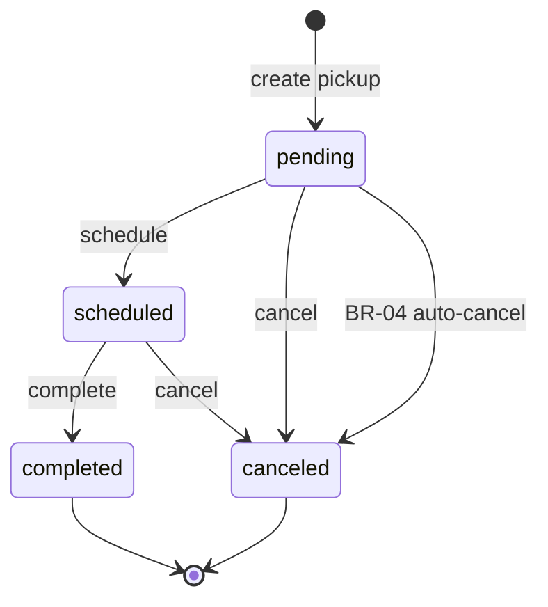
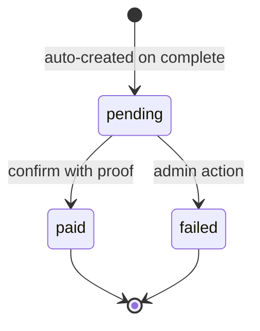
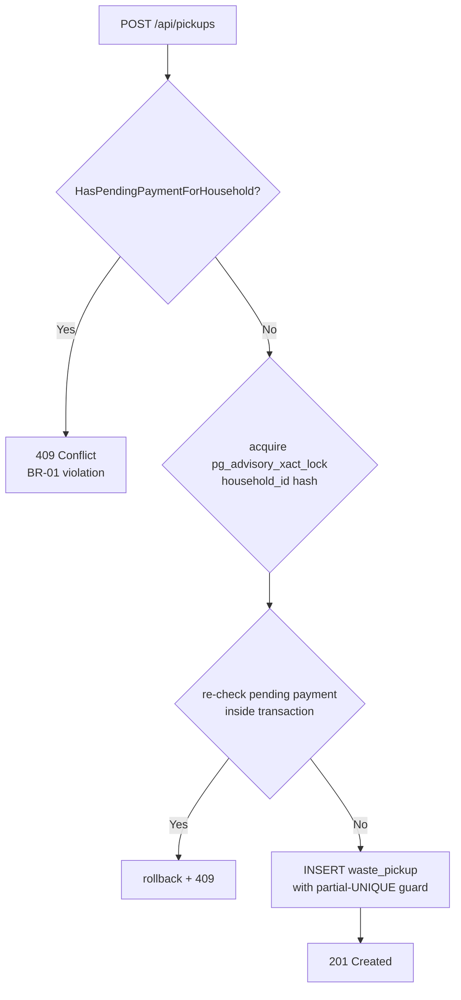
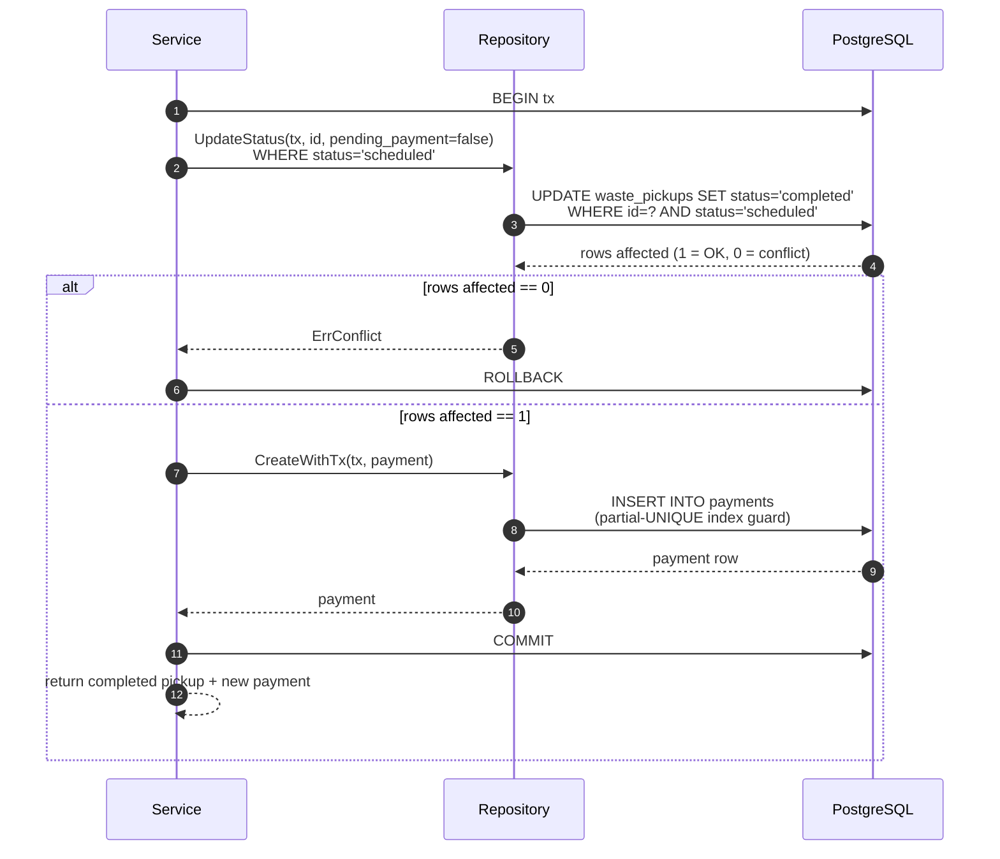
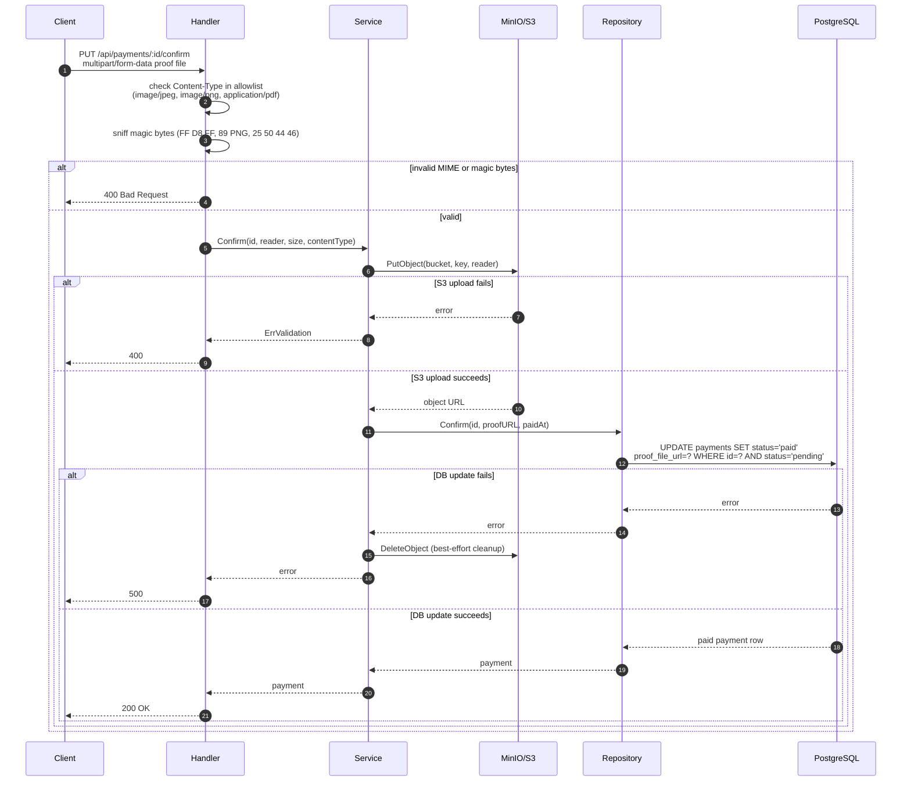
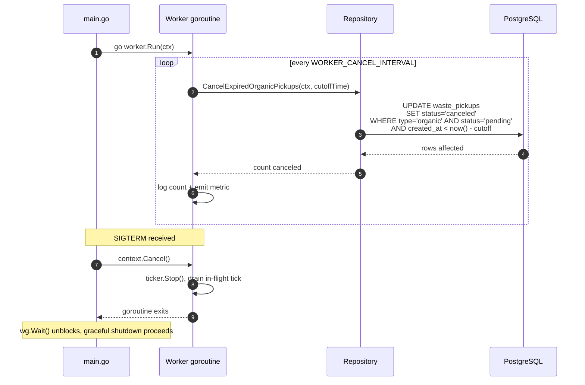

# Business Processes

End-to-end flows and state machines for the core business rules. Each
diagram is paired with the code path that enforces it.

---

## Pickup Lifecycle

Every pickup moves through a defined set of states. Business rules gate
each transition.

**Enforcement:** `internal/service/pickup.go` — each transition uses a
conditional `UPDATE … WHERE status = <expected>` that returns `ErrConflict`
when the row is already in a different state (BR-02 safety net).

---

## Payment Lifecycle

Payments are created automatically when a pickup completes (BR-05) and
confirmed by uploading a proof file (BR-06).

**Enforcement:** `internal/service/payment.go:Confirm` — uploads the
multipart proof file to MinIO, then performs a conditional DB update. On
storage success + DB failure the uploaded object is deleted as best-effort
cleanup.

---

## Pickup Creation — BR-01 Gate

A household cannot have a new pickup created while a pending payment
exists for it. The gate is enforced at both the service layer and the DB.

**Enforcement layers:**
1. `service/pickup.go:Create` — `HasPendingPaymentForHousehold` query before the advisory lock.
2. `pg_advisory_xact_lock` — serialises concurrent creates for the same household.
3. Partial UNIQUE index `uq_pickups_pending_per_household` — DB-level safety net for any concurrent bypass.

---

## Complete Pickup — BR-05 Atomic Transaction

Completing a pickup and creating its payment record happens inside a
single database transaction. Either both succeed or neither does.

**Code:** `internal/service/pickup.go:Complete` (lines 182–264).

---

## Payment Confirm — BR-06 Proof Upload Flow

Confirming a payment requires a valid proof file. The handler enforces
the MIME allowlist and magic-byte check before the service uploads to S3.

**Code:** `internal/handler/payment.go:104-163` (MIME + magic-byte check),
`internal/service/payment.go:Confirm` (S3 upload + DB update + cleanup).

---

## BR-04 Worker — Organic Auto-Cancel

A background goroutine periodically cancels organic pickups that were
never scheduled within the configured cutoff window.

**Code:** `internal/worker/organic_canceler.go`. Context cancellation is
handled inside the `for range ticker.C` loop; in-flight DB queries carry
the same context and return promptly when cancelled.
