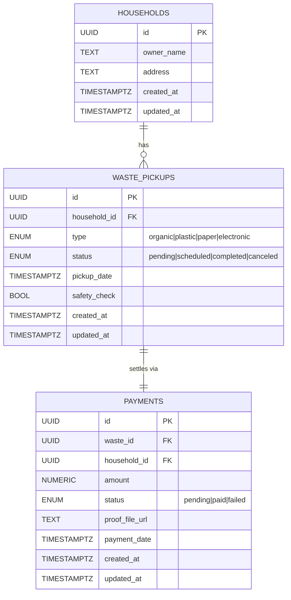
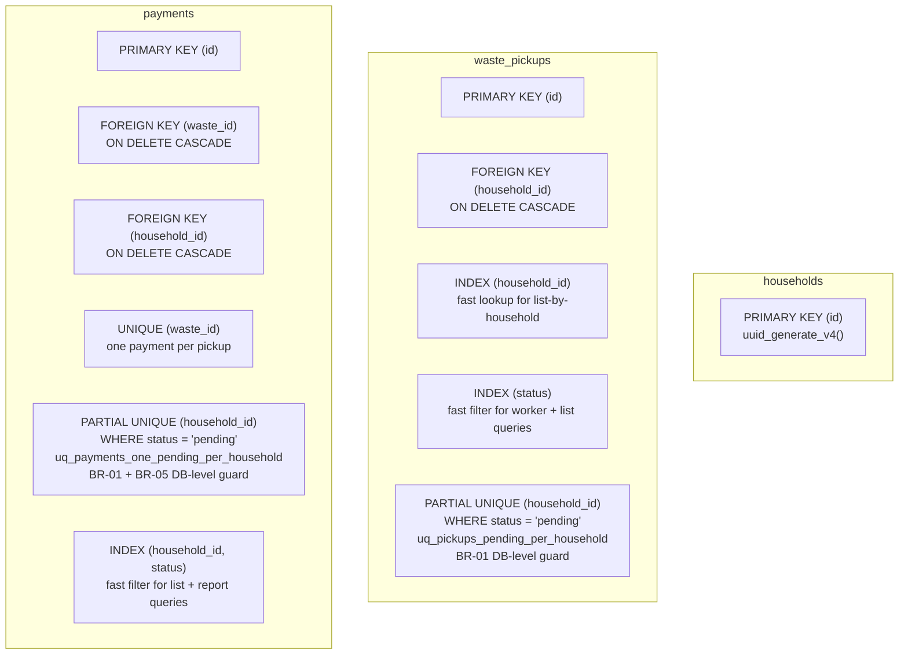

# Data Model

Schema, relationships, and index strategy for the Community Waste
Collection API.

---

## Entity-Relationship Diagram

Three core entities. Deleting a household cascades to all its pickups,
which cascade to all their payments.

**Domain structs:** `internal/domain/household.go`, `internal/domain/pickup.go`,
`internal/domain/payment.go`. All UUID primary keys are generated by
`uuid_generate_v4()` at the DB layer via `CREATE EXTENSION IF NOT EXISTS "uuid-ossp"`.

---

## Index Strategy

Indexes serve two purposes: (1) fast lookups for the list + filter queries,
and (2) data-integrity enforcement for business rules.

### Key design decisions

- **Partial UNIQUE indexes on `status = 'pending'`** — both the pickups
  and payments tables carry a partial unique constraint scoped to
  `pending` rows. This means there can be at most one pending pickup per
  household (BR-01) and at most one pending payment per household
  (BR-05). Once a row transitions out of `pending` the constraint no
  longer applies and new pending rows are allowed.
- **`ON DELETE CASCADE`** — deleting a household removes all its pickups,
  which removes all their payments in a single FK chain. No orphaned rows.
- **UUID primary keys** — generated by the DB (`uuid_generate_v4()`),
  never by the application layer. Prevents duplicate-key collisions even
  under concurrent inserts.

---

## Migration History

Numbered sequential migrations under `migrations/`. Each ships as a pair
of `.up.sql` and `.down.sql` files.

| # | File prefix | Purpose |
|---|-------------|---------|
| 1 | `000001_create_tables` | Baseline schema: households, waste_pickups, payments with all required columns |
| 2 | `000002_add_indexes` | Lookup indexes on FK columns |
| 3 | `000003_enum_changes` | Waste type enum refinements |
| 4 | `000004_unique_pending_payment` | Partial UNIQUE `uq_payments_one_pending_per_household` — DB guard for BR-01 / BR-05 |
| 5 | `000005_performance_indexes` | Composite indexes for list + filter query paths |

Run with: `make migrate-up` or `migrate -path=migrations -database "$DATABASE_URL" up`.
