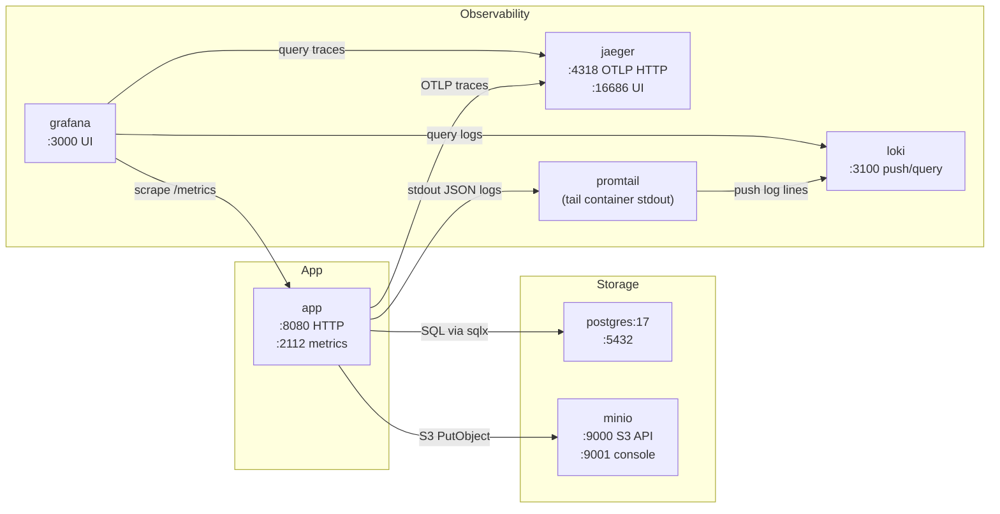
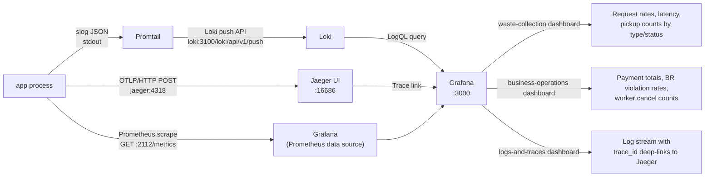
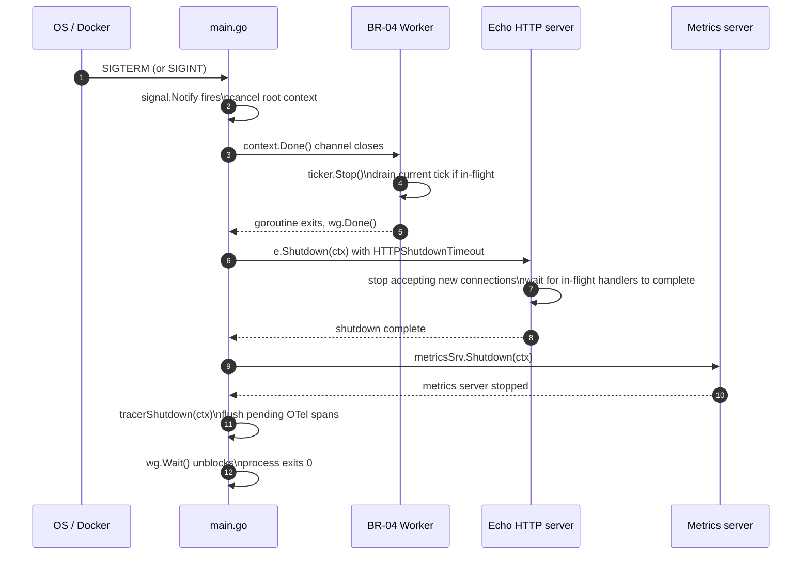

# Deployment

Docker Compose stack, observability data paths, and graceful shutdown
sequence for the Community Waste Collection API.

---

## Docker Compose Topology

The full stack is defined in `deployments/docker-compose.yml`. A single
command starts all services: `make up` (or `docker compose -f deployments/docker-compose.yml up --build -d`).



**Named volumes:** `postgres_data`, `minio_data`, `loki_data`, `grafana_data`
— all persist across container restarts.

---

## Observability Data Flow

Three correlated signal types. All carry the same `trace_id`.



---

## Graceful Shutdown Sequence

The application catches SIGINT or SIGTERM and drains all in-flight work
before exiting. No request or background job is dropped on a clean
shutdown.



**Code:** `cmd/api/main.go:160-210`. The `sync.WaitGroup` ensures the
process does not exit until both the HTTP server and the worker have
finished draining.

---

## Running the Stack

```bash
# Start everything (build + detach)
make up

# Apply database migrations
make migrate-up

# Tail application logs
make logs

# Stop and remove containers + volumes
make down
```

See `README.md` → Quick Start for the full setup walkthrough including
MinIO bucket creation and Grafana login.
