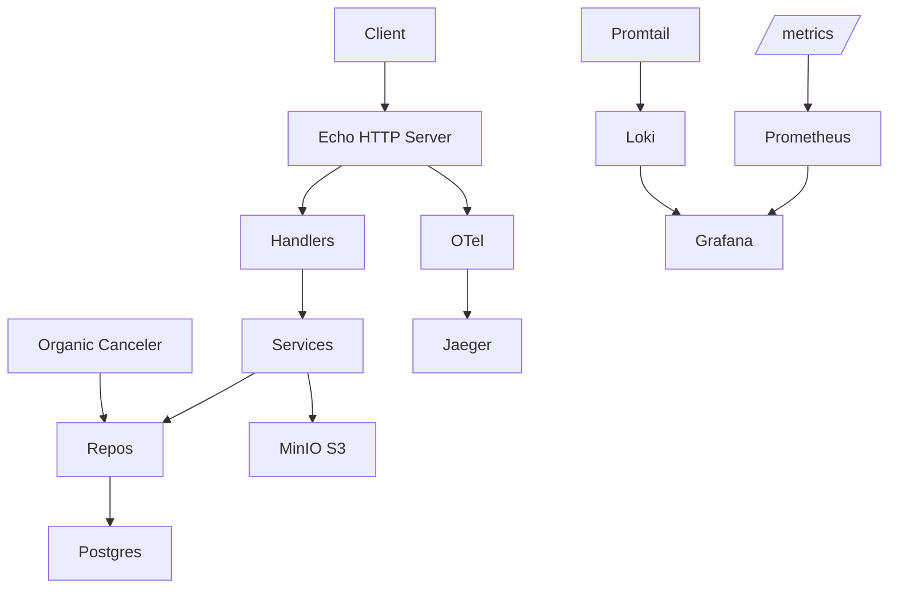

# Phase 6 — Adversarial Gap Closure

## Purpose

Close the remaining review-flaggable gaps uncovered by two rounds of adversarial
audit of the codebase against the published backend engineering test brief.
Phases 0–5 delivered the spec; Phase 6 hardens it against a paranoid reviewer.

The phase is organised into 7 tiers totalling 56 tasks. **Execute Tier 5 first
within the code-change batches** — those are real correctness bugs (TOCTOU
races on the business invariants). Tiers 1–4 are test depth and observability;
Tiers 6–7 are hardening and polish.

The PDF brief and `REQUIREMENTS_RAW.md` remain gitignored. No company name,
email, address, or phone number from the brief is permitted in any committed
file.

---

## Adversarial Findings — Headline Issues

### Critical correctness bugs (Tier 5)
1. **BR-01 TOCTOU**: `HasPendingPaymentForHousehold` + `Create` in `internal/service/pickup.go:33-68` are not atomic. Two parallel `POST /api/pickups` from the same household both see "no pending payment" and both insert.
2. **BR-02 race in Schedule**: the UPDATE at `internal/repository/pickup.go:217-220` has no `WHERE status='pending'` predicate, so two concurrent schedule calls can both win.
3. **BR-05 atomicity gap in Complete**: the tx wraps UpdateStatus + CreatePayment but has no `SELECT … FOR UPDATE` on the pickup row, so two concurrent Complete calls both pass the status check.

### High-impact reliability gaps (Tier 6)
- N+1 in `HouseholdHistory` (3 sequential queries) — `internal/service/report.go:53-70`
- Missing composite indexes on `payments(household_id, status)` and `waste_pickups(type, status, created_at)`
- Rate limiter `sync.Map` never evicts — `internal/middleware/ratelimit.go`
- Worker has no panic recovery — `internal/worker/organic_canceler.go:38-52`
- No HTTP timeouts (slow-loris) — `cmd/api/main.go`
- Body size limit only on `/confirm`; other POSTs are unbounded
- No security headers, no MIME allowlist on uploads

### Test depth gaps (Tier 1)
- `internal/service/report.go` has zero unit tests
- `Complete` idempotency / tx rollback / cascade-delete / payment date filter / worker DB error / graceful-shutdown / migration roundtrip — none exercised

### Production-readiness polish (Tier 2)
- No `/readyz` endpoint, no Request-ID middleware, no Troubleshooting in README, no formal ADRs

### Beyond-spec hardening (Tier 3)
- Postman collection not executed in CI, no Prometheus alerts, no Insomnia export, no error-envelope contract test

### Unified log/trace observability (Tier 4 — explicit user request)
- No log aggregation (Loki) → can't search logs by trace_id
- `span_id` not in logs (only `trace_id`)
- No Grafana dashboard pivoting trace ↔ logs

### Delivery DX (Tier 7)
- No CHANGELOG, CONTRIBUTING, `/api/version`, Postman environment file, Mermaid diagrams, exhaustive OpenAPI examples

---

## Tier 1 — Test Depth (T1–T8)

### T1 — Unit tests for `internal/service/report.go`

`internal/service/report.go` (70 lines, exposes WasteSummary / PaymentSummary /
HouseholdHistory) is only exercised via E2E. Add `internal/service/report_test.go`
with a `ReportServiceSuite` mirroring the existing service suites:

- `TestWasteSummary_DelegatesToRepo` — verifies the slice is returned as-is.
- `TestWasteSummary_RepoError_Propagates` — verifies wrapping.
- `TestPaymentSummary_DelegatesToRepo` + error path.
- `TestHouseholdHistory_DelegatesToRepo` + `TestHouseholdHistory_NotFound`.

Reuse the existing `mocks.NewPaymentRepository(t)`.

### T2 — Complete transaction rollback path

Extend `internal/service/pickup_test.go` with `TestComplete_PaymentCreateFails_RollsBack`:
mock `CreateWithTx` to return an error; assert UpdateStatus was rolled back by
expecting `pickup.Status == 'scheduled'` afterwards (or verifying the tx mock
sees a `Rollback()` call, depending on the abstraction).

### T3 — Complete idempotency

Extend `internal/service/pickup_test.go` with
`TestComplete_AlreadyCompleted_ReturnsConflict`: mock FindByID to return a
pickup with `status='completed'`; assert `ErrConflict`. Pair with E2E
`TestPickup_DoubleComplete_Returns409` in `test/e2e/pickup_test.go`.

### T4 — DELETE /api/households cascade

Extend `test/e2e/household_test.go` with `TestHousehold_DeleteCascadesToPickupsAndPayments`:
create household → pickup → complete (auto-payment) → DELETE household → assert
GET /api/pickups?household_id=… returns empty AND GET /api/payments?household_id=…
returns empty AND that the records are physically gone (separate DB check).

### T5 — Payment date-range filter E2E

Extend `test/e2e/payment_test.go` with `TestPayment_ListFilters_DateRange`:
seed three payments spanning three days, then call
`GET /api/payments?date_from=…&date_to=…` and assert the response contains only
the rows in the window. Also assert nullable `payment_date` (pending payments)
are excluded.

### T6 — Worker DB error handling

Extend `internal/worker/organic_canceler_test.go` with
`TestWorker_BulkCancelError_DoesNotCrashLoop`: inject a repo that returns
an error from `BulkCancel`; advance time and assert the worker continues to
the next tick (no panic, log emitted).

### T7 — Graceful shutdown integration test

New `test/integration/shutdown_test.go` (build tag `integration`):
1. Start the API in-process with a tiny `WorkerCancelInterval` (e.g. 100ms).
2. Trigger `cancel()` on the app context.
3. Assert the worker's WaitGroup unblocks within the configured shutdown timeout.
4. Assert HTTP server is closed (Shutdown returns nil).

Reuse the existing testcontainers Postgres fixture from
`internal/repository/db_test.go`.

### T8 — Migration roundtrip

New `test/integration/migrations_test.go` (build tag `integration`):
spin up a Postgres testcontainer, `migrate.Up()`, `migrate.Down()`,
`migrate.Up()` again — assert each transition is clean.

---

## Tier 2 — Production-Readiness Polish (T9–T12)

### T9 — `/readyz` endpoint

Liveness vs readiness split: `/health` stays as liveness (200 if process is
alive and DB ping works), `/readyz` adds worker-running flag and S3
connectivity check. Return 200 only when all upstreams are reachable.

```go
func (h *Handler) ReadyzHandler(c echo.Context) error {
    if err := h.db.PingContext(c.Request().Context()); err != nil { return c.JSON(503, ...) }
    if !h.workerRunning.Load() { return c.JSON(503, ...) }
    return c.JSON(200, map[string]string{"status":"ready"})
}
```

Test in `internal/handler/misc_test.go`.

### T10 — Request-ID middleware

`internal/middleware/request_id.go`:
- If `X-Request-ID` is present on request, use it (validate UUID-ish format).
- Else generate `uuid.NewString()`.
- If OTel span context is valid, use `span.SpanContext().TraceID()` as preference.
- Set on response header `X-Request-ID`.
- Stash on `echo.Context` as `request_id` for the logger middleware to pick up.

Apply globally in `internal/handler/handler.go` `RegisterRoutes`.

### T11 — README Troubleshooting + Prerequisites

Add sections covering: port conflicts (8080, 5432, 9000, 9090, 3000, 16686),
MinIO bucket auto-creation behaviour, migrate CLI install instructions on
macOS / Linux, otel-collector boot order issues.

### T12 — Formal ADRs

Extract the 8 narrative bullets from README §Architecture Decisions into
`docs/adr/0001-no-orm.md` … `0008-prometheus-red-metrics.md`. Use MADR
format:

```
# ADR-0001: Use sqlx, not an ORM

## Status
Accepted (2026-06-02)

## Context / Decision / Consequences
…
```

Add `docs/adr/README.md` as an index.

---

## Tier 3 — Beyond-Spec Hardening (T13–T16)

### T13 — Newman in CI

New `contract` job in `.github/workflows/ci.yml` after `e2e`:
1. `make docker-up`
2. Wait for `/health` 200 (max 60s).
3. `newman run api/community-waste.postman_collection.json --env-var base_url=http://localhost:8080 --bail`
4. `make docker-down` regardless of outcome.

### T14 — Prometheus alerts

`deployments/prometheus/alerts.yml`:
- `HighErrorRate`: `rate(http_requests_total{status=~"5.."}[5m]) / rate(http_requests_total[5m]) > 0.05` for 5m
- `HighLatencyP99`: `histogram_quantile(0.99, rate(http_request_duration_seconds_bucket[5m])) > 1.0` for 10m
- `WorkerStalled`: `increase(worker_cycles_total[10m]) == 0`
- `DatabaseUnhealthy`: `up{job="waste-collection-api"} == 0` for 2m

Wire via `rule_files:` in `deployments/prometheus.yml`. Document SLOs in
README §Observability.

### T15 — Insomnia export

`api/community-waste.insomnia_collection.json` — convert the Postman collection
via `npx insomnia-importers postman` or by hand if needed. All 27+ requests
included.

### T16 — Error envelope shape contract

`internal/handler/error_envelope_test.go`:
table-driven test that POSTs invalid payloads to every mutating endpoint,
asserts each response has shape:
```json
{ "success": false, "error": { "code": "...", "message": "..." } }
```

---

## Tier 4 — Unified Log/Trace Observability (T17–T22)

### T17 — `span_id` in logs

`internal/middleware/logger.go`: add
`slog.String("span_id", span.SpanContext().SpanID().String())` alongside the
existing `trace_id`. Mirror in `internal/middleware/recover.go`. Add a
`observability.LogAttrsFromContext(ctx)` helper for service-layer logs.

### T18 — Loki + Promtail in docker-compose

`deployments/docker-compose.yml`:
```yaml
loki:
  image: grafana/loki:3.1.0
  ports: ["3100:3100"]
  command: -config.file=/etc/loki/local-config.yaml
  volumes:
    - ./loki-config.yaml:/etc/loki/local-config.yaml:ro
    - loki_data:/loki
  healthcheck:
    test: ["CMD", "wget", "-qO-", "http://localhost:3100/ready"]
    interval: 10s
promtail:
  image: grafana/promtail:3.1.0
  command: -config.file=/etc/promtail/config.yaml
  volumes:
    - /var/run/docker.sock:/var/run/docker.sock:ro
    - ./promtail-config.yaml:/etc/promtail/config.yaml:ro
  depends_on:
    loki: { condition: service_healthy }
```

`deployments/loki-config.yaml`: single-binary mode, filesystem storage.

`deployments/promtail-config.yaml`: docker socket scrape with JSON pipeline
extracting `level`, `msg`, `trace_id`, `span_id`, `request_id`, `method`,
`path`, `status` as labels (low-cardinality) or extracted fields
(`trace_id`, `request_id`).

### T19 — Grafana datasources

`deployments/grafana/provisioning/datasources/loki.yaml`:
```yaml
- name: Loki
  type: loki
  url: http://loki:3100
  jsonData:
    derivedFields:
      - name: trace_id
        matcherRegex: "trace_id=([a-f0-9]+)"
        url: "${__value.raw}"
        datasourceUid: jaeger-uid
        urlDisplayLabel: "View trace"
```

Update `jaeger.yaml`:
```yaml
- name: Jaeger
  type: jaeger
  uid: jaeger-uid
  jsonData:
    tracesToLogsV2:
      datasourceUid: loki-uid
      tags: [{ key: 'service.name', value: 'service' }]
      filterByTraceID: true
      filterBySpanID: false
      customQuery: true
      query: '{service="waste-api"} | json | trace_id="${__trace.traceId}"'
```

### T20 — Logs & Traces dashboard

`deployments/grafana/dashboards/logs-and-traces.json` panels:
1. Log volume by level (Loki rate panel).
2. Error log stream (`{job="waste-api"} | json | level="error"`).
3. Trace-ID variable + filter logs panel.
4. Request rate by status (Prometheus).
5. Embedded Jaeger search panel.

### T21 — Trace ↔ log correlation smoke test

In the `contract` CI job, after newman: capture a `trace_id` from Jaeger
(`/api/traces?service=community-waste-collection-api&limit=1`), then query Loki
(`/loki/api/v1/query_range?query={service="waste-api"} | json | trace_id="<id>"`)
and assert ≥1 line returned.

### T22 — Codecov badge + coverage claim

Replace the prose `>80%` claim in README with `**Unit coverage: <actual>%** —
gate ≥80%`. Add a numeric badge from shields.io alongside the existing graph
badge:
```markdown
[](https://codecov.io/...)
[](https://codecov.io/...)
```

---

## Tier 5 — Concurrency / Data Integrity (T23–T27, CRITICAL — execute first within code batches)

### T23 — BR-01 advisory lock

`internal/repository/pickup.go` adds:
```go
func (r *pickupRepository) CreateWithHouseholdLock(ctx context.Context, p *Pickup, hadPending func(ctx context.Context, q sqlx.QueryerContext) (bool, error)) error {
    return runInTx(ctx, r.db, func(tx *sqlx.Tx) error {
        if _, err := tx.ExecContext(ctx, "SELECT pg_advisory_xact_lock(hashtextextended($1::text, 0))", p.HouseholdID); err != nil { return err }
        pending, err := hadPending(ctx, tx)
        if err != nil { return err }
        if pending { return fmt.Errorf("pending payment exists: %w", ErrConflict) }
        return tx.NamedExecContext(ctx, insertPickupSQL, p)
    })
}
```

Refactor `internal/service/pickup.go:Create` to call the new method instead of
its current two-step check.

### T24 — Conditional UPDATEs

`internal/repository/pickup.go`:
- Schedule: `UPDATE waste_pickups SET status='scheduled', pickup_date=$2, updated_at=NOW() WHERE id=$1 AND status='pending'`
- Cancel: `WHERE id=$1 AND status IN ('pending','scheduled')`
- Complete UpdateStatus: `WHERE id=$1 AND status='scheduled'`

In each, check `RowsAffected()` — if 0, return `ErrConflict`. Update
`internal/service/pickup.go` to propagate.

### T25 — SELECT FOR UPDATE on Complete

In `internal/service/pickup.go:Complete`, replace the standalone
`FindByID(ctx, id)` with a tx-aware `FindByIDForUpdate(ctx, tx, id)` that
issues `SELECT id, status FROM waste_pickups WHERE id=$1 FOR UPDATE`. This
serialises competing Completes.

### T26 — Concurrency E2E

`test/e2e/concurrency_test.go`:
```go
func (s *E2ESuite) TestPickup_ConcurrentComplete_OnlyOneWins() {
    pickup := s.createScheduledPickup(...)
    var wg sync.WaitGroup
    results := make([]int, 8)
    for i := 0; i < 8; i++ {
        wg.Add(1)
        go func(i int) {
            defer wg.Done()
            results[i] = s.completePickup(pickup.ID).StatusCode
        }(i)
    }
    wg.Wait()
    wins := count(results, 200); conflicts := count(results, 409)
    s.Equal(1, wins); s.Equal(7, conflicts)
    payments := s.listPaymentsForPickup(pickup.ID)
    s.Len(payments, 1)
}
```

Mirror for Schedule.

### T27 — Partial UNIQUE index

`migrations/000004_partial_unique_pending_payment.up.sql`:
```sql
CREATE UNIQUE INDEX IF NOT EXISTS uq_payments_one_pending_per_household
ON payments(household_id) WHERE status = 'pending';
```
Down: `DROP INDEX IF EXISTS uq_payments_one_pending_per_household;`

This enforces BR-01 at the schema level: at most one pending payment per
household; any second insert hits the UNIQUE constraint.

---

## Tier 6 — Performance + Hardening (T28–T43)

### T28 — Parallel HouseholdHistory

`internal/service/report.go`:
```go
g, ctx := errgroup.WithContext(ctx)
var hh *Household; var picks []*Pickup; var pays []*Payment
g.Go(func() error { return s.householdRepo.FindByID(ctx, id, &hh) })
g.Go(func() error { return s.pickupRepo.ListByHousehold(ctx, id, &picks) })
g.Go(func() error { return s.paymentRepo.ListByHousehold(ctx, id, &pays) })
if err := g.Wait(); err != nil { return nil, err }
```

### T29 — Composite indexes

`migrations/000005_perf_indexes.up.sql`:
```sql
CREATE INDEX IF NOT EXISTS idx_payments_household_status ON payments(household_id, status);
CREATE INDEX IF NOT EXISTS idx_pickups_type_status_created ON waste_pickups(type, status, created_at);
CREATE INDEX IF NOT EXISTS idx_households_created_at ON households(created_at);
```

### T30 — Rate limiter eviction

`internal/middleware/ratelimit.go`: replace `sync.Map` with a struct holding a
`sync.RWMutex` map of `{limiter *rate.Limiter, lastSeen atomic.Int64}`. Spawn a
janitor goroutine that every 5 minutes deletes entries idle >30m. Expose
`rate_limit_active_clients` gauge.

### T31 — Worker panic recovery

`internal/worker/organic_canceler.go`:
```go
for {
    select {
    case <-ctx.Done(): return
    case <-ticker.C:
        func() {
            defer func() {
                if r := recover(); r != nil {
                    w.logger.Error("worker panic", "panic", r, "stack", debug.Stack())
                    metrics.WorkerCyclesFailedTotal.Inc()
                }
            }()
            w.run(ctx)
        }()
    }
}
```

Add `WorkerCyclesFailedTotal` counter.

### T32 — HTTP timeouts

`cmd/api/main.go` before `e.Start`:
```go
e.Server.ReadHeaderTimeout = cfg.HTTPReadHeaderTimeout    // 5s default
e.Server.ReadTimeout       = cfg.HTTPReadTimeout          // 15s default
e.Server.WriteTimeout      = cfg.HTTPWriteTimeout         // 15s default
e.Server.IdleTimeout       = cfg.HTTPIdleTimeout          // 60s default
```

Add env vars to `internal/config/config.go` and `.env.example`.

### T33 — Global body-size limit

`internal/handler/handler.go`: apply `echomw.BodyLimit("1MB")` globally; keep
the per-route `MaxBytesReader` on `/confirm` for the larger upload size.

### T34 — MIME allowlist

`internal/service/payment.go:Confirm`:
- Read first 512 bytes, run `http.DetectContentType(buf)`.
- Reset the reader (use `io.MultiReader(bytes.NewReader(buf), r)`).
- Reject if detected type ∉ `{image/jpeg, image/png, application/pdf}`.

### T35 — Security headers

`internal/handler/handler.go`: apply Echo `middleware.Secure()` globally.
Custom CSP only on `/api/docs` if needed.

### T36 — DB pool tuning

`internal/repository/db.go`:
```go
db.SetConnMaxLifetime(30 * time.Minute)
db.SetConnMaxIdleTime(cfg.DBConnMaxIdleTime)
// append application_name to DSN if not present
```

Add pool gauges in `internal/observability/metrics.go` updated every 15s via a
goroutine reading `db.Stats()`.

### T37 — Tuned histogram buckets

`internal/observability/metrics.go`:
```go
http_request_duration_seconds: {0.005, 0.01, 0.025, 0.05, 0.1, 0.25, 0.5, 1, 2.5, 5}
db_query_duration_seconds:     {0.0005, 0.001, 0.0025, 0.005, 0.01, 0.025, 0.05, 0.1, 0.25}
s3_upload_duration_seconds:    {0.05, 0.1, 0.25, 0.5, 1, 2.5, 5, 10}
```

### T38 — Explicit column lists

`internal/repository/*.go`: replace each `SELECT *` with the explicit column
list matching the destination struct fields.

### T39 — Startup config logging

`internal/config/config.go`: add `func (c Config) LogRedacted(logger *slog.Logger)`
that calls `logger.Info("config loaded", …)` with sensitive fields masked
(`S3SecretKey: "****"`, DSN password stripped, etc.). Call from `cmd/api/main.go`
immediately after `config.Load()`.

### T40 — Config validation

`internal/config/config.go`: `func (c Config) Validate() error` checks:
- `WorkerOrganicCutoffDays >= 1`
- `RateLimitRPS >= 1`, `RateLimitBurst >= 1`
- `Port >= 1` and `Port <= 65535`
- `DBMaxOpenConns >= 1`
Call from `main.go`; fail-fast.

### T41 — Split shutdown timeouts

Add `HTTPShutdownTimeout` (15s) and `WorkerShutdownTimeout` (30s) to config.
Pass to respective shutdown contexts in `cmd/api/main.go`.

### T42 — Sanitised error message

`internal/handler/payment.go:101`: replace
`fmt.Sprintf("proof file required: %v", err)` with `"proof file required"`;
log the underlying `err` at warn-level for ops.

### T43 — Dockerfile hardening

`build/Dockerfile`:
```dockerfile
RUN addgroup -S app && adduser -S -G app -u 65532 app
USER app
HEALTHCHECK --interval=30s --timeout=3s CMD wget -qO- http://localhost:8080/health || exit 1
```

---

## Tier 7 — Delivery Polish + DX (T44–T56)

### T44 — Postman count fix
Update README to match actual count from
`jq '[.. | objects | select(.request?)] | length' api/community-waste.postman_collection.json`.

### T45 — Postman environment file
`api/community-waste.postman_environment.json` with `base_url`,
`household_id`, `pickup_id`, `payment_id` variables.

### T46 — CHANGELOG.md
Keep-a-Changelog format. Sections: Unreleased, 0.1.0 (delivery), with bullets
for each phase + post-delivery fixes.

### T47 — CONTRIBUTING.md
Recipes for: add a new endpoint, add a new BR, run a single test, regenerate
mocks, run only E2E, run only perf benchmarks.

### T48 — /api/version endpoint

`cmd/api/main.go`: package-level `var version, commit, buildDate string`
populated via `-ldflags '-X main.version=… -X main.commit=… -X main.buildDate=…'`.
Pass to the handler. Register `GET /api/version` returning
`{version, commit, built_at}`. Document in OpenAPI.

Update Makefile `build` target:
```makefile
build: ## Build the API binary with embedded version info
	CGO_ENABLED=0 go build -trimpath -ldflags="-w -s \
	  -X main.version=$$(git describe --tags --always 2>/dev/null || echo dev) \
	  -X main.commit=$$(git rev-parse --short HEAD) \
	  -X main.buildDate=$$(date -u +%Y-%m-%dT%H:%M:%SZ)" \
	  -o bin/api ./cmd/api
```

Same in `build/Dockerfile` via `ARG`.

### T49 — Mermaid diagrams in README

Add component diagram:


Add sequence diagram for happy path: create household → create pickup →
schedule → complete → auto-payment → confirm.

### T50 — Sample JSON log line in README
Add a 5-line code-fenced JSON sample showing structured fields.

### T51 — `make help`
```makefile
.PHONY: help
help: ## Show this help
	@awk 'BEGIN {FS = ":.*?## "} /^[a-zA-Z_-]+:.*?## / {printf "  \033[36m%-20s\033[0m %s\n", $$1, $$2}' $(MAKEFILE_LIST)
```
Add `##` doc comments to every existing target.

### T52 — `make mocks`
```makefile
mocks: ## Regenerate mocks via go generate
	go generate ./...
```
Add `//go:generate` directives at top of `internal/domain/*.go`.

### T53 — Expanded godoc
Each interface in `internal/domain/` gets a 3–4 line block summarising
responsibilities, error contract (`ErrNotFound`, `ErrConflict`, …), and
trace-span emission.

### T54 — Failure modes in README
New section enumerating behaviour when each upstream is down + recovery.

### T55 — Exhaustive OpenAPI examples
Add `example:` to every request body, response body, and enum value in
`api/openapi.yaml`.

### T56 — `.dockerignore` audit
Ensure it excludes `bin/`, `coverage*.out`, `*.md`, `test/`, `plans/`, `.git/`,
`.github/`, `docs/`, `node_modules/`.

---

## Execution Order

Per the approved plan: plan files → Tier 1 → Tier 2 → Tier 3 → Tier 4 → Tier 5 → Tier 6 → Tier 7 → final verification.

Each tier produces 1–3 commits with conventional-commit prefixes. CI must stay green between tiers.

## Verification

End-to-end smoke commands per tier are in
`/home/hafiz/.claude/plans/foamy-knitting-hearth.md` §Verification.
